# MedCore — a clinic management system

A full-stack clinic system built as eight Spring Boot microservices behind a
Spring Cloud Gateway, with a React front end. It covers the work an outpatient
clinic actually does: registering patients, booking and running a clinic day,
invoicing from a priced catalogue, issuing prescriptions and filing laboratory
results.

Authentication is Keycloak with OpenID Connect. Every service validates its own
tokens, and record ownership is decided from claims in the token rather than
from anything the browser sends.

> Every record in this deployment is fictional. This is a portfolio project and
> is not certified for real medical data.

### [Open the live demo →](https://myheart.mdchaouni.workers.dev)

Seven roles, one click each, no password. It is the real interface answering its
own requests, with the same clinic as the seeded database - see
[the hosted demo](#the-hosted-demo) for what that means and what it does not.

[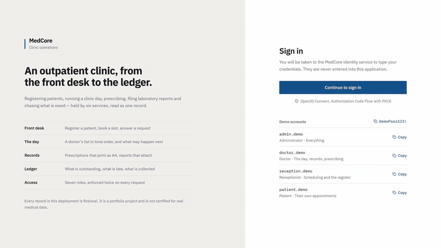](https://youtu.be/AJEzYZvm-dY)

*Thirteen seconds of it. [Watch the full walkthrough on
YouTube](https://youtu.be/AJEzYZvm-dY) - two and a half minutes across every
screen and three accounts - or take
[the file](docs/medcore-walkthrough.mp4).*

---

## Contents

- [Live demo](https://myheart.mdchaouni.workers.dev) · [walkthrough video](https://youtu.be/AJEzYZvm-dY)
- [What it does](#what-it-does)
- [The screens](#the-screens)
- [Running it](#running-it)
- [The hosted demo](#the-hosted-demo)
- [Design system](#design-system)
- [Front-end architecture](#front-end-architecture)
- [Back-end architecture](#back-end-architecture)
- [Authorization](#authorization)
- [Tests](#tests)
- [Repository layout](#repository-layout)
- [What is not here yet](#what-is-not-here-yet)
- [Technologies](#technologies)

---

## What it does

One clinic, seven roles, six services holding the record between them.

```text
Receptionist registers a patient
  → books a slot with an available doctor
  → the appointment is confirmed and an invoice is raised
  → the doctor sees the patient and marks the consultation complete
  → the doctor writes a prescription and requests a laboratory test
  → the laboratory files the result and attaches the report
  → the patient reads all of it in their own portal, and nothing else
```

Every step in that line is a screen below, and every one of them is enforced
twice: once at the gateway, once inside the service that owns the data.

| Role | Lands on | Reaches |
|---|---|---|
| `ADMIN` | Overview | Everything |
| `DOCTOR` | Today | Patients, appointments, calendar, prescriptions, labs |
| `RECEPTIONIST` | Overview | Registration, scheduling, invoices |
| `BILLING` | Overview | The ledger |
| `NURSE` | Overview | The register and the day |
| `LAB_TECHNICIAN` | Laboratory | Laboratory requests and results only |
| `PATIENT` | My health | Only their own records |

---

## The screens

Each role lands somewhere different after signing in, because a shared home
page is a dead end for most of them.

### Sign in

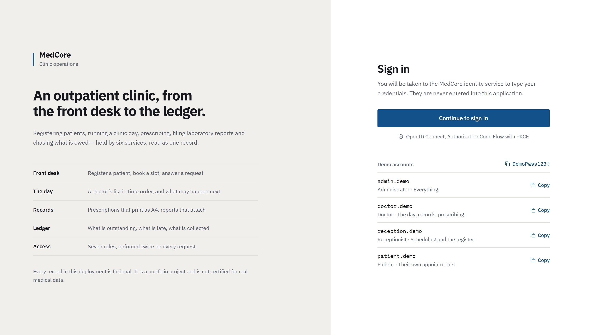

There is no password field. Authentication uses the Authorization Code Flow
with PKCE, so credentials are typed on Keycloak's own screen and this
application never handles them.

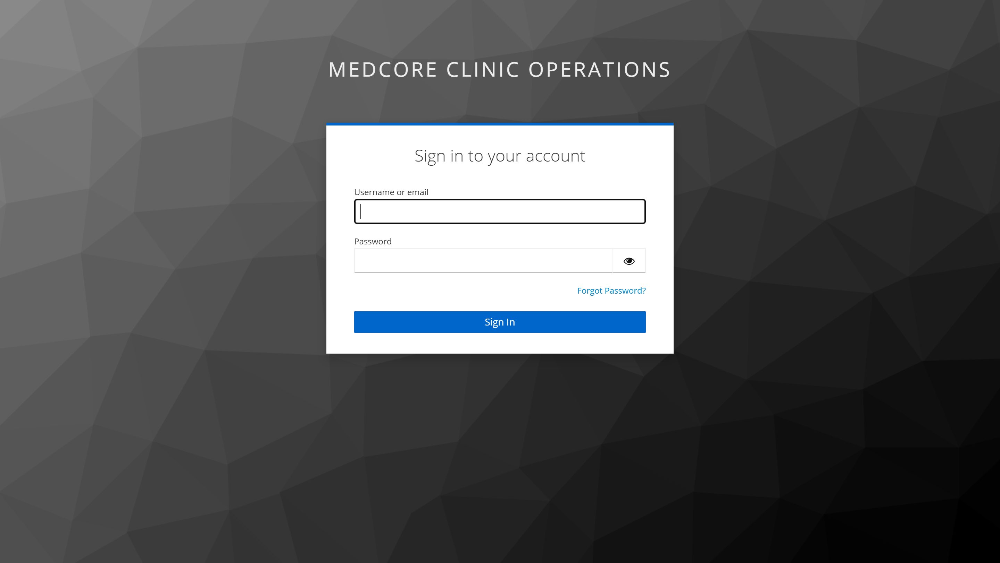

Two panels: a typographic statement on the left, the sign-in on the right.
There are no figures on it. An earlier version reported "6 clinical services ·
5 staff roles · 1 patient record", which described the architecture rather than
anything a user of the clinic needed to know.

### Overview — `/`

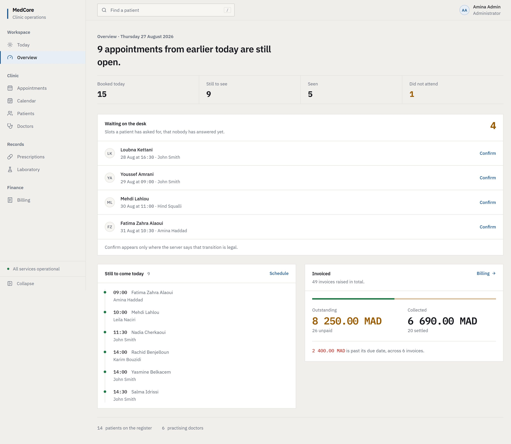

The clinic's operations screen, ordered by the questions the person running a
clinic actually asks: **is today under control**, **what needs a decision**,
**where is the money**.

The three are deliberately not equal. The queue of unanswered requests is the
widest block and the only one carrying a count at display size, because it is
the only region where looking at the screen is supposed to end in a click; the
money panel is a quiet ledger below it. A grid of equally sized statistic cards
would say that nothing on the page is more urgent than anything else, which is
never true of a clinic.

Figures sit on hairlines rather than in cards: at this density a card around
every number is chrome competing with the number inside it. Every panel is
gated on the roles the gateway will actually serve, so a doctor never fires the
billing request that would come back 403.

The title carries the state of the day in one sentence in place of a greeting,
which is the one line on an operations screen guaranteed to read the same every
morning.

Five bounded requests back the whole screen. Today arrives as one day-windowed
page and the wide numbers come from page envelopes and a database-side billing
summary, rather than by downloading every row and counting in the browser.

### Today — `/today` · doctor, admin

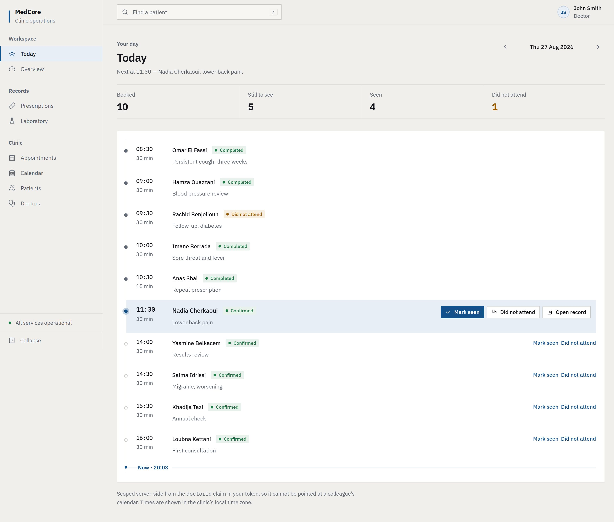

The doctor's working day rather than a report. The composition rests on one
idea: the day is a line, and the doctor is somewhere along it.

Appointments hang off a single vertical rule in time order, and where the clock
has reached is drawn on that rule as a marked line — consultations above it
dimmed, the rest still to come. The next patient's row is opened out, with a
larger time, the reason for the visit and the actions, so the question a doctor
has between patients is answered without reading anything else.

Marking a patient seen or a no-show is offered only when the appointment's
`allowedTransitions` permits it, so the UI never has to guess the rules. A
completed consultation carries no buttons at all, because the state machine
allows nothing further.

The day is scoped server-side from the `doctorId` claim in the token, so it
cannot be pointed at a colleague's calendar.

### Calendar — `/appointments/calendar` · admin, doctor, receptionist

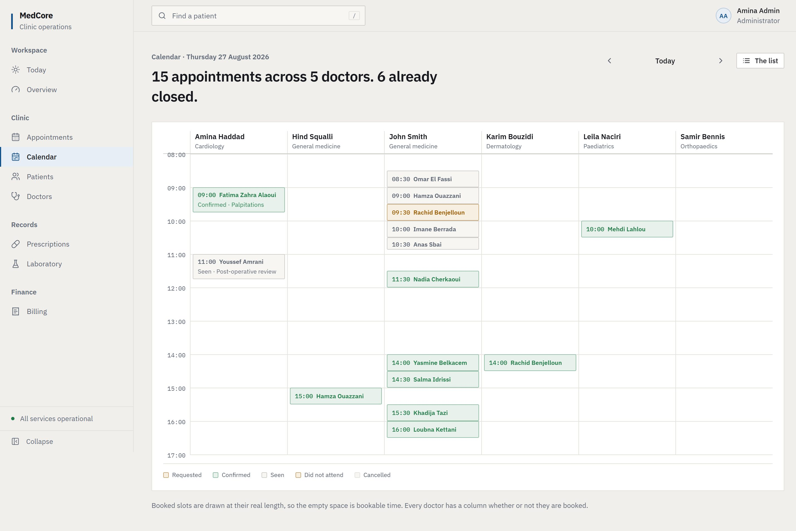

The diary answers "what is next". This answers "where is the gap", and they are
different questions: a list has no idea how long anything takes, so five
appointments look identical whether they fill the morning or sit an hour apart.

**A column per doctor.** Merged into one column, two doctors booked at 14:00
read as an overlap, and an overlap has to be resolved by splitting the width and
hoping the names still fit. They are not an overlap. They are two people working
at the same time, which is what a clinic looks like on an ordinary Tuesday. A
column each makes the collision disappear structurally, and answers the question
the front desk actually holds — *who is free at 14:00* — by looking down a
column.

Every doctor keeps a column whether or not they are booked. An empty column is
not wasted space here; it is the answer.

The vertical range is computed from the day rather than fixed at 08:00–19:00,
with no padding band, so the whole clinic day fits on one screen. Drawing an
empty evening for a clinic that finishes at four defeats the point of having
drawn it to scale.

The legend is a deliberate exception to the rule that colour never travels
alone. A half-hour block is thirty pixels tall and holds one line, and that line
is spent on the time and the patient. Something had to give and it was not going
to be the patient's name, so the word moves off the block and onto the screen,
with every block repeating it in its title.

### Appointments — `/appointments` · admin, doctor, receptionist

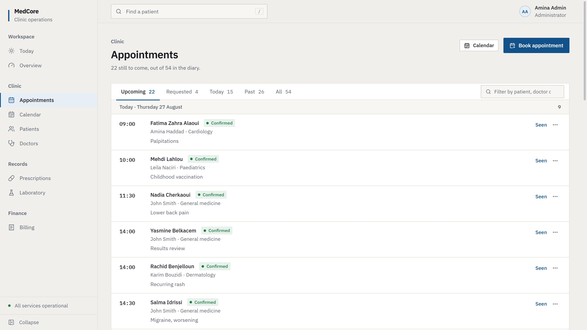

The diary, grouped by day and sorted within the day, opening on what is ahead —
a receptionist arriving here is almost never asking about a consultation from
four months ago. The lifecycle is a row of tabs carrying live counts, so
"Requested · 4" says there is work waiting before anything has been clicked.

Actions come from `allowedTransitions`, which the server returns on every
appointment: the move a row is actually waiting for is promoted inline, and the
rest sit behind one quiet row menu with the destructive item marked and
separated. Cancelling was previously a red button repeated down thirty rows,
which made the most destructive action in the product the easiest to hit and
taught people to stop seeing red. It now asks for confirmation by naming the
patient, the day and the time.

Slots are checked for conflicts server-side using half-open intervals, so a
booking that merely touches the end of another is allowed and one that overlaps
is refused.

Appointments move through `REQUESTED → CONFIRMED → COMPLETED`, with `CANCELLED`
and `NO_SHOW` as the other terminal states. Who books decides where it starts:
the desk books a slot directly and it begins confirmed, a patient can only ask
and theirs begins requested.

### Patients — `/patients` · admin, doctor, receptionist, nurse

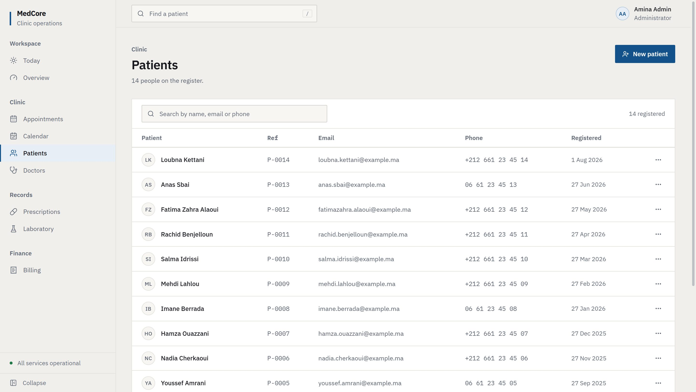

The register, built around search, scan, identify, open. The search field
queries the database rather than the loaded page, debounced, so the list stays
the same size whatever the clinic's does; the patient's name is the link, so the
thing you read is the thing you click. Columns fold into the name cell as the
viewport narrows rather than disappearing.

Editing and deleting live in the row menu. They previously sat in an actions
column as a pencil and a red bin on every row — a column of destructive buttons
on a screen nobody opens in order to delete anybody.

### Patient record — `/patients/:id`

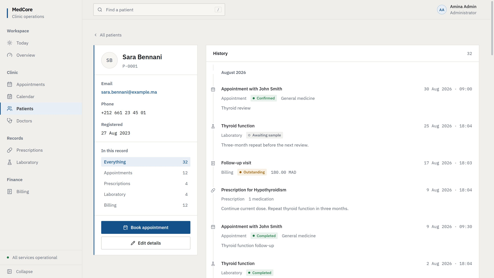

One patient and everything that has happened to them, so a clinician stops
opening four tabs. Appointments, prescriptions, laboratory work and billing are
merged into a single thread in time order, grouped by month.

Identity sits in a **Storyboard rail** that never leaves the screen. That is
Epic's pattern, adopted for Epic's stated reason rather than for the look of it:
it removes scrolling and page jumps and keeps the clinician oriented while they
work inside a sub-view.

The rail's counts are also the filter, so the tabs that used to duplicate them
are gone.

Colour is not how you tell an appointment from a lab test: each kind carries a
small glyph on the rule and its name in words, and the colour on a row belongs
to the *status* — the part that might need something from the reader.

The merge happens in the browser deliberately: a timeline endpoint would have to
call all four services anyway, and putting it inside one of them would make that
service depend on the other three for a screen only the front end uses. Each
source is fetched independently, so one service being down names itself —
"Billing temporarily unavailable" — in place, with a retry, while the rest of
the record stays usable. A failed source's count reads as unknown rather than as
zero, which would be a lie about the patient.

### Doctors — `/doctors` · admin, doctor, receptionist

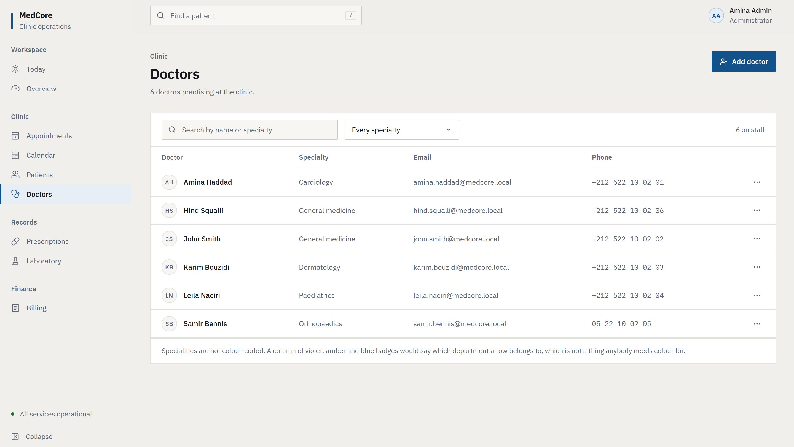

The same table as the patient register, deliberately, because two lists of
people in one product should not be two designs. What differs is what the list
is for — a doctor is looked up by what they do, so specialty is a column and the
list narrows to one specialty in a click.

Specialties are not colour-coded. Assigning each one an accent produced a column
of violet, amber, blue and rose saying nothing about urgency or state.

### Billing — `/billing` · admin, billing, receptionist

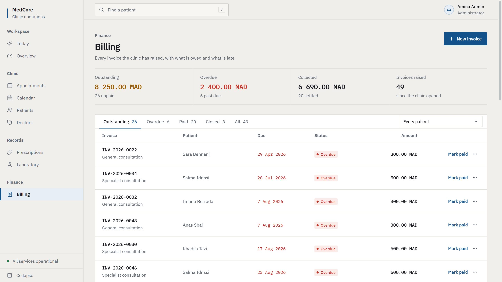

The clinic's ledger — every invoice, oldest debt first, with the totals across
the top and the patient filter demoted to one filter among several. It used to
show nothing at all until a patient had been chosen from a dropdown, which is
backwards: the question a billing clerk arrives with is *who owes us money*, and
no single patient answers it.

Money is set in the identifier face, aligned right, and never abbreviated. Amber
marks what is owed and rose marks what is late; a paid invoice is plain grey,
because a settled invoice needs nothing from anybody.

Invoices are priced from the clinic's service catalogue rather than from a
number typed into the code. An invoice runs `ISSUED → PAID → REFUNDED` or
`ISSUED → VOID`. There is deliberately no overdue state: being overdue is what
an unpaid invoice becomes once its due date passes, so it is derived on read
rather than stored.

Invoice creation is idempotent by appointment, enforced by a unique constraint,
so a retried billing call finds the existing invoice instead of charging twice.

### Prescriptions — `/prescriptions` · admin, doctor, receptionist

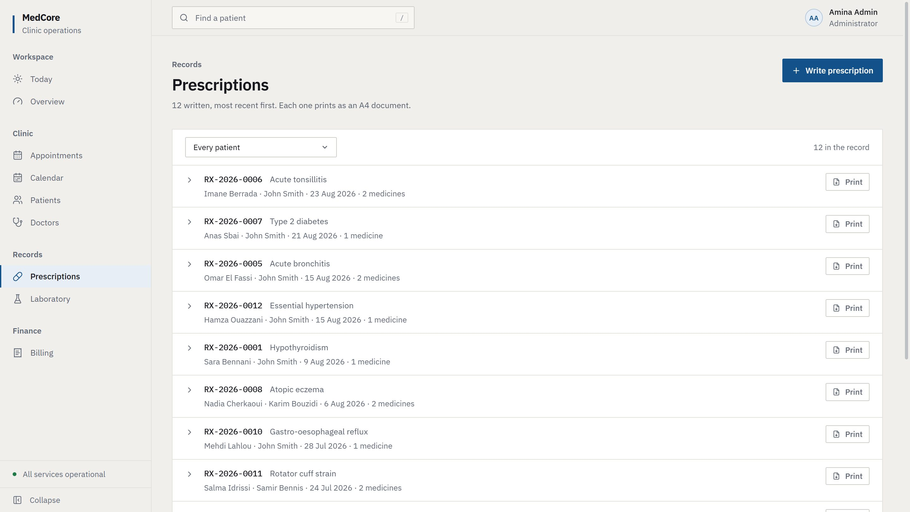

Everything written, most recent first, expandable to the medicines on each, and
filterable by patient — not gated behind choosing one, so "what did I write this
week" is answerable.

Prescriptions name people. The rows previously read "Patient #4 · Dr. #3", which
is what the database stores rather than what anybody needs.

Printing is treated as the workflow it is. Every row carries a labelled **Print**
button that fetches a rendered A4 PDF: letterhead, who it is for, who wrote it, a
medication table with the "how to take it" line running full width underneath
each drug, and the line the prescriber signs. The document carries a notice on
its face that it is a demonstration produced by a portfolio project and is not a
valid prescription.

### Laboratory — `/labs` · admin, doctor, receptionist, lab technician

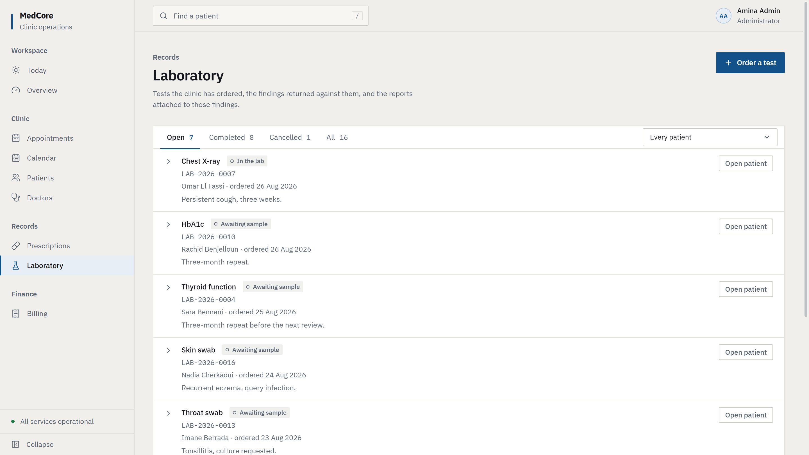

Laboratory information has a shape, and the screen is built around it:
**request, then result, then report.** A doctor asks for a test; the laboratory
writes a finding against it; a scan or an exported PDF may be attached to that
finding. Each stage exists without the next, so results hang off the request on
the same rule the day and the patient timeline use.

**This is where a `LAB_TECHNICIAN` lands**, and the only place they can act:

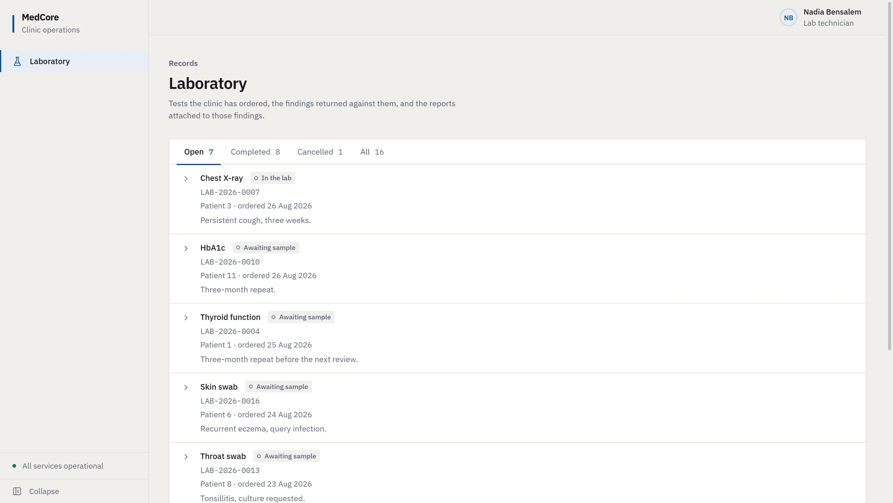

The patient register is not served to them, so they see the patient number
rather than the name, and the filter and the link into a record are both
withheld. Uploading is offered to doctors, admins and lab technicians only;
writing the finding itself is doctors and admins. The gateway serves
`POST /labs/results/*/file` to a technician and every other `POST /labs/**` only
to those two, so the two permissions are tracked separately.

### My health — `/my-health` · patient

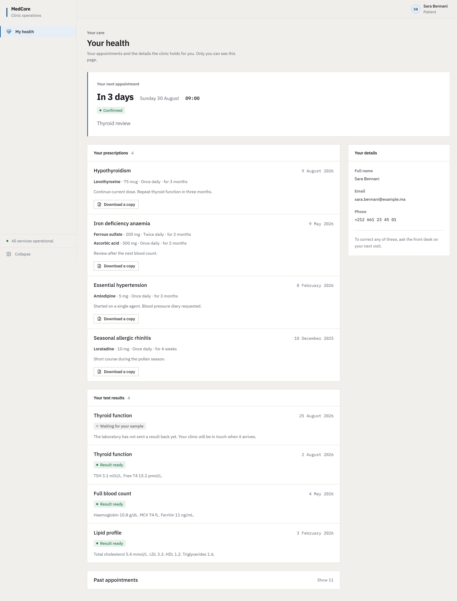

The one screen not built for staff, and built to a different brief. A
receptionist wants density; a patient wants one answer, and nine times out of
ten the answer is when their next appointment is — so that is the largest thing
on the page, given as "In 3 days · Sunday 30 August · 09:00".

It also carries their prescriptions and test results, read-only, each with the
one action that matters: the printed prescription, and the report file.

The clinic's lifecycle is renamed on the way out: `REQUESTED` is how the state
machine describes a slot nobody has answered, and "Awaiting confirmation" is what
that means to the person who asked for it. A laboratory request is "Waiting for
your sample", "At the laboratory" or "Result ready". Where the doctor's name
cannot be read — the gateway does not serve the doctor register to a patient —
the line is omitted rather than printing the circuit breaker's fallback string.

Everything is narrowed server-side to the `patientId` claim; nothing is filtered
in the browser.

### Access denied

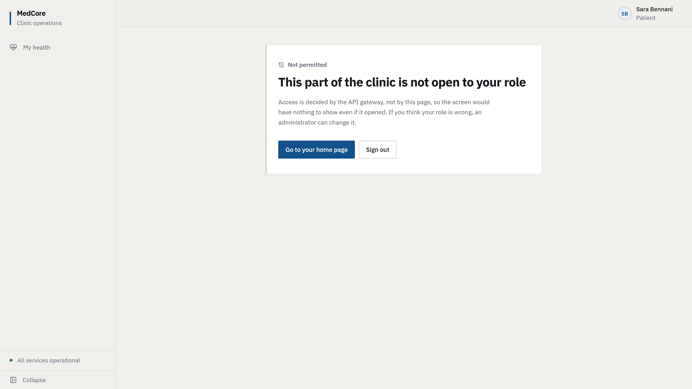

Reached when a role does not cover a route. It renders **inside** the layout,
with the navigation the role does have, and always offers a route home. An
earlier version rendered outside it and left a patient looking at a refusal with
no navigation and no way to sign out.

### Both themes

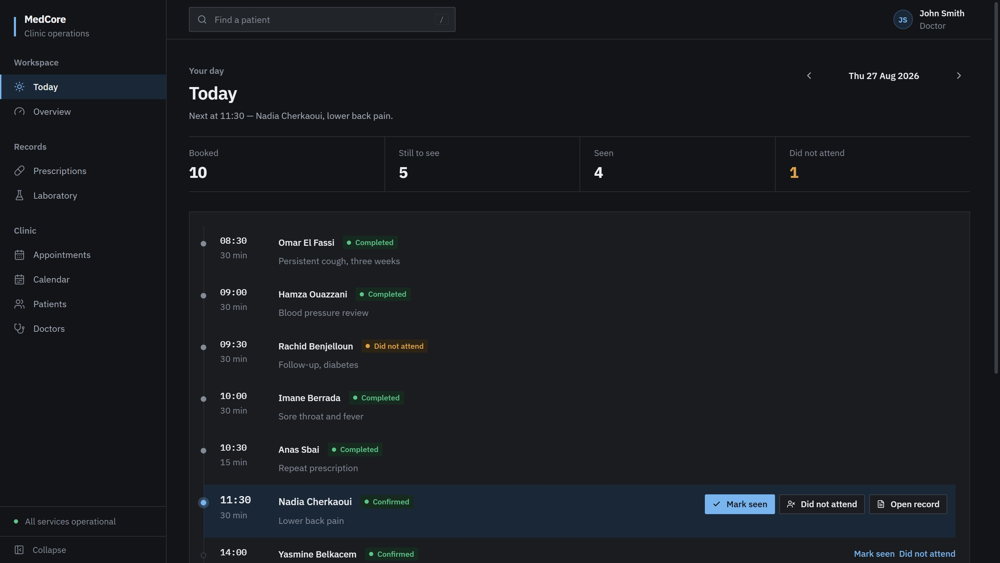

Light by default, dark as a real option, generated from the same tokens and
measured for contrast in both. `system` is a first-class third state.

---

## Running it

### Prerequisites

- Docker and Docker Compose
- Node.js 18 or newer
- JDK 17 to 21 if building the services outside Docker. The build enforces this:
  Lombok does not support JDK 22 or later, and the failure without the enforcer
  is around ninety confusing "cannot find symbol" errors.

### 1. Back end

```bash
cd Backend
cp .env.example .env      # then fill in the credentials
docker compose up --build -d
```

Compose reads `.env` for every database and Keycloak credential and fails fast
with a clear message if one is missing. `.env` is gitignored and should never be
committed.

**Sixteen containers** come up: eight Spring Boot services, seven PostgreSQL
databases and Keycloak. Give them a minute or two; `api-gateway` and
`appointment-service` are the last to report healthy. The Eureka dashboard at
`http://localhost:8761` shows what has registered.

The databases arrive with a clinic already in them. Flyway applies the schema and
then a `V900__demo_seed.sql` per service: fourteen patients, six doctors,
fifty-four appointments, forty-nine invoices, twelve prescriptions and sixteen
laboratory requests. Every date is written relative to `now()`, so the demo has a
real today whenever it is started or reset — a seed with fixed dates is a clinic
that was busy last spring and has been shut since.

### 2. Front end

```bash
cd Frontend
cp .env.example .env
npm install
npm run dev
```

The application runs at **`http://localhost:3000`**. That port is fixed in
`vite.config.js` because it is one of the redirect URIs registered for the
Keycloak client; changing it means updating the realm too.

### 3. Sign in

The realm, its roles and these users are imported from
`Backend/keycloak/realm-export.json` on first start, so a fresh clone gets an
identical working setup with no console steps.

| Account | Role | Lands on |
|---|---|---|
| `admin.demo` | Administrator | Overview |
| `doctor.demo` | Doctor | Today |
| `reception.demo` | Receptionist | Overview |
| `patient.demo` | Patient | My health |
| `lab.demo` | Lab technician | Laboratory |

Password for all five: `DemoPass123!`

`doctor.demo` carries a `doctorId` claim of `2` and `patient.demo` a `patientId`
claim of `1`; those are what the ownership checks read, and they match the
seeded rows.

### Useful commands

```bash
# Front end
npm run dev              # dev server on :3000
npm run build            # production build
npm run lint             # eslint, zero warnings tolerated
npm test                 # vitest, once
npm run test:coverage    # with a coverage report

# Back end
cd Backend/<service> && mvn clean package
docker compose logs -f <service>
docker compose up -d --build <service>    # rebuild one service
docker compose down -v                    # wipe volumes and reseed on next start
```

---

## The hosted demo

The system is sixteen containers. Nobody evaluating a portfolio is going to
start sixteen containers, and no free host will run them.

So the front end can answer its own requests. Built with `VITE_DEMO_MODE=true`
it installs an **axios adapter where the network would be**: the service
modules, React Query, the interceptors and every screen run unmodified and
unaware. There is no second implementation of anything.

```bash
cd Frontend
VITE_DEMO_MODE=true npm run dev
```

What it reproduces faithfully, because a demo that behaves differently is a
demo of a different product:

- **The same clinic as the SQL seed** — same ids, same dates relative to now.
- **The gateway's authorization**, transcribed from `SecurityConfig` method by
  method. A lab technician still cannot read the patient register; a doctor
  still cannot open the ledger.
- **Ownership**, decided the way `CallerIdentity` decides it: collections are
  narrowed to the caller rather than filtered afterwards.
- **Both state machines**, copied, so no row offers an action the real system
  would refuse.
- **Writes** — confirming, paying, registering and booking all work and persist
  for the life of the tab, overlap detection included.

What it does not do is stated plainly in [`Frontend/src/demo/README.md`](Frontend/src/demo/README.md),
including that it is a fidelity exercise and not a security boundary.

It is deployed at **<https://myheart.mdchaouni.workers.dev>**.

Deploying it is free. On Cloudflare the settings are root directory
`Frontend`, build `npm run build`, output `dist`, and the environment variable
`VITE_DEMO_MODE=true` - without which the build succeeds and every screen then
reaches for a gateway that is not there. `Frontend/wrangler.jsonc` carries
`not_found_handling: single-page-application`, which is what makes a route like
`/appointments/calendar` survive a refresh instead of 404ing.

---

## Design system

Named **Ledger**, and arrived at by research rather than by taste. Twelve
references were studied before anything was drawn — shipping clinical software
(Epic, Oracle Health), published healthcare design systems (the NHS digital
service manual, Cerner's Terra), peer-reviewed guidance on clinical interface
design, and the non-healthcare products that solve one of MedCore's problems
better than healthcare does (Stripe on dense financial tables, Linear on theming
and restraint).

Three findings did most of the work.

### Light by default, dark as a real option

The positive-polarity advantage is well established: text on a light ground is
read faster and with **more errors caught**, and the advantage grows as type
gets smaller. MedCore is made of 14px names, doses, dates and amounts, which is
exactly where it bites hardest.

The counter-argument is genuine and is not cosmetic — a clinician spends tens of
thousands of hours in front of this, and for anyone with early lens clouding less
display light means less scatter. So dark is offered properly. Both themes are
generated from the same tokens, `system` is a first-class third state, and no
colour in the product is defined in only one of them.

### Four colours, four meanings

The peer-reviewed guidance on clinical interface colour coding caps it at four
with fixed meanings, and requires colour to be paired with a word or symbol,
because a hue on its own is nothing to a colour-blind reader.

| Meaning | Light | Dark | Used for |
|---|---|---|---|
| **Attention** | `#9A5B00` | `#E0A34A` | a decision is owed, or money is |
| **Critical** | `#C4342B` | `#F08379` | late, failed, destructive |
| **Settled** | `#1F7A47` | `#5EC48A` | paid, confirmed, complete |
| **Closed** | `#616977` | `#828A96` | correctly finished; nothing expected |

Laboratory lost its blue — a lab request is a kind of record, not a state, and
the glyph and the word already say so. A patient who did not attend lost its
orange and became attention, because somebody has to deal with it. States that
are genuinely in flight get a hollow dot and no colour at all, so the palette
holds at four while the state machine has more states than that.

### The rest of the palette

| Token | Light | Dark | Role |
|---|---|---|---|
| Ground | `#F0EFEC` | `#131417` | the page and the chrome |
| Surface | `#FFFFFF` | `#1A1C20` | panels, rows, inputs |
| Raised | `#F7F6F3` | `#212429` | a hovered row, a menu |
| Ink | `#16181D` | `#ECEEF1` | the subject of a row |
| Ink secondary | `#5A6270` | `#A3ABB7` | supporting detail |
| Ink muted | `#616977` | `#828A96` | metadata, timestamps |
| Rule | `#E2E1DC` | `#2A2D33` | hairlines and gridlines |
| Primary | `#12518A` | `#78B4EE` | interaction, links, focus |

The ground is a hair warm rather than clinical white. It is the thing on screen
a reader looks at constantly, and it is the cheapest way to stop the product
reading as a hospital login. The primary is a deep institutional blue rather
than the default SaaS blue: dark enough that it never fluoresces against white,
and it is the only colour on the page that *does* something.

**Every text colour clears WCAG AA against both the ground and a panel, and the
ratios were measured in the browser rather than worked out on paper.** That
distinction earned its place: the muted token was first set to `#767E8B`,
calculated as 4.6:1 and actually reading 3.6:1, while carrying every timestamp
and section label in the product.

### Typography

One family, two cuts.

| Face | Where |
|---|---|
| **IBM Plex Sans** | everything that is read |
| **IBM Plex Mono** | everything that is identified — clock times, invoice and result numbers, amounts, phone numbers |

Plex was drawn for technical and enterprise data, and it does the thing the
medical-typography literature actually asks for: `0` is distinguishable from `O`,
and `1` from `l` from `I`. In a product where a dose and a reference number are
read at speed, that is a safety property rather than a preference.

Staff screens sit at **14px**, the size the clinical guidance names as optimal.
The patient portal steps to **16px** — the same system, read by somebody who is
not paid to be fluent in it.

**Everything is sentence case.** Both the NHS manual and the peer-reviewed alert
guidance name all-caps as measurably harming comprehension, and it was doing most
of the labelling in this product. No italics, no underline outside links, bold
used sparingly.

### Shape, surface and density

The radius scale tops out at **4px** and the only round things are status dots
and avatars. A clinical record is a ruled sheet. There is one shadow token and it
is used only by things that genuinely float: a menu, a dialog, the mobile drawer.

The signature motif is **the spine** — a left rule with content hanging off it,
markers sitting on the line. The doctor's day, the patient's history and the
laboratory's request → result → report chain all use it, so a clinician moving
between them reads the same shape each time.

**Row height is a setting**, comfortable or compact, because a receptionist
working a register and a doctor glancing between patients want different ones and
choosing for both is choosing wrong for one.

### Ten rules every screen follows

1. **The subject is the largest thing.** A row is about a person or a record.
2. **Four colours, four meanings.** Everything else is ink on a neutral.
3. **Colour never travels alone.** Every coloured state carries a word.
4. **Sentence case everywhere.** Bold sparingly; no italics or underline.
5. **Numbers are mono, tabular, right-aligned in columns.** Money in full.
6. **One primary action per region.** A control repeated down every row is quiet.
7. **Destructive actions are never the default.** Behind a menu, marked, and
   confirmed by naming the record.
8. **Layer by priority, not category.** Critical first, detail one step deeper.
9. **Never offer what the server will refuse.** Roles and `allowedTransitions`
   decide what renders.
10. **Partial failure is a designed state.** One service down names itself; the
    rest of the screen keeps working.

---

## Front-end architecture

React 18 with Vite 8, Tailwind 3, React Router 6 and TanStack Query 5.

```text
Frontend/src/
├── auth/
│   ├── keycloak.js          # keycloak-js instance
│   ├── AuthProvider.jsx     # init, token refresh, roles and claims in context
│   ├── ProtectedRoute.jsx   # ProtectedRoute (session) + RequireRole (role)
│   └── roles.js             # role names, per-route rules, landing pages
├── components/
│   ├── layout/              # Layout, Sidebar, Header, PatientSearch
│   └── ui/                  # Page, Panel, Figures, Segmented, Menu, Modal,
│                            # ConfirmDialog, StatusBadge, EmptyState,
│                            # ErrorBanner, LoadingSpinner, Pagination, Avatar
├── demo/                    # the hosted demo: fixtures, adapter, role switcher
├── hooks/                   # one module per domain, plus useClinicOverview
│                            # and usePatientTimeline which compose several
├── pages/                   # one directory per area, forms beside their page
├── services/                # axiosInstance + one API module per service
└── utils/                   # dates, initials, validation
```

**Server state lives in React Query, not in components.** Caching, invalidation,
loading and error states come from there; `useState` is used for local UI only.
Queries are stale after 30 seconds and do not refetch on window focus, which is
deliberate for clinical data.

**One axios instance, one request interceptor and one response interceptor.** The
token is attached on the way out; on the way back 401 clears the session and
bounces to login with a `returnTo`, and 403 is handled separately because signing
someone out for lacking a role would be a bug.

**Route guards are a usability layer, not a security boundary.** The gateway and
the services enforce the real rules; `roles.js` exists so people are not shown
doors that will not open. Paths carrying an id are matched back to their route
pattern rather than compared as strings, because an unmatched path falls through
to "authenticated only".

**The dev server proxies `/api` to the gateway**, so there is no CORS setup in
development.

**The shell is one component, and navigation is role-ordered.** The sidebar
groups links by the kind of work rather than by which microservice serves them,
and orders the groups by who is signed in: a doctor's day starts with clinical
work, a billing clerk opens the product to do money.

**Below 1024px the sidebar is an off-canvas drawer.** Before, a 240px panel held
its width at every viewport, so on a phone it took two thirds of the screen and
clipped the work into what was left.

---

## Back-end architecture

Database-per-service, service discovery through Eureka, one gateway in front, and
OpenFeign with Resilience4j circuit breakers between services.

| Service | Port | Database | Responsibility |
|---|---|---|---|
| API Gateway | `8080` | none | Single entry point; validates JWTs and applies path and role rules |
| Eureka Server | `8761` | none | Service registry |
| Patient Service | `8001` | `patientdb` | The patient register |
| Billing Service | `8002` | `billingdb` | Invoices, lifecycle and the priced service catalogue |
| Doctor Service | `8003` | `doctordb` | The medical register |
| Prescription Service | `8004` | `prescriptiondb` | Prescriptions and the printable document |
| Lab Service | `8005` | `labdb` | Laboratory requests, results and report files |
| Appointment Service | `8006` | `appointmentdb` | Booking rules, lifecycle, and orchestration across patient, doctor and billing |
| Keycloak | `8480` host → `8080` internal | `keycloakdb` | Identity provider |

All databases are PostgreSQL 16, migrated with Flyway.

Some decisions worth knowing before reading the code:

- **Fallbacks are cause-aware.** A `FeignException.NotFound` becomes a 404, not a
  503, so a doctor who simply does not exist is not reported as an outage.
- **Lists are paged and searched server-side** and enriched in batches. Building a
  page of appointments costs two remote calls in total, not two per row.
- **Invoices are raised on confirmation**, not on request, so a slot the clinic
  never agrees to does not leave a void invoice behind.
- **Uploaded files are typed by reading their bytes**, never by trusting the
  declared content type or the file name, and are stored under generated keys so
  nothing a client sends reaches the filesystem.
- **The migrations build the schema the entities expect.** They did not always.
  These databases were originally created by Hibernate `ddl-auto` and then
  baselined, so the first migrations were written after the fact and never ran
  anywhere; four of six services could not start from a clean clone. Each service
  now carries a reconciliation migration, written to be correct against both a
  clean database and an existing one, and a clean `docker compose up` is checked
  rather than assumed.

---

## Authorization

Three layers, each of which would be enough on a good day and none of which is
trusted to be the only one.

**1. The gateway** validates the token and applies coarse path and role rules,
mapping Keycloak's `realm_access.roles` claim onto Spring authorities. Every path
prefix ends in a rule matching all remaining methods, rather than an allow-list
of verbs that leaves the rest to fall through.

**2. Each service validates the token again for itself.** Any container on the
Docker network, and anything on the host given the published ports, can call a
service directly. A bypassed gateway is not a breach.

**3. Ownership is decided per record**, after the row is read, against the claims
in the token. A patient may read the record whose id matches their `patientId`
claim and no other; changing the number in the URL returns 403, not somebody
else's data. Where a patient asks for a collection, the query is narrowed rather
than the response filtered, so nothing that is not theirs is ever loaded.

The code behind layers 2 and 3 lives in one place. `common-lib` holds
`KeycloakRoleConverter`, which maps the realm roles onto Spring authorities, and
`CallerIdentity`, which answers "who is asking, and whose records may they see".

`CallerIdentity` takes the roles a service treats as staff as a constructor
argument, and every service declares its own set in its `SecurityConfig` where a
reader will find it. The membership genuinely differs: lab-service counts
`LAB_TECHNICIAN` as staff, because processing a sample requires reading the
request and the result; appointment-service and prescription-service deliberately
do not, because filing a laboratory report is no reason to read a diary or a
prescription. The difference is now a declaration rather than an accident — which
is what it was when the class was copied three times and the copies drifted.

Verified end to end against the running stack, with real tokens:

```
patient.demo  GET /patients/1  (own)          200
patient.demo  GET /patients/2  (someone else) 403
patient.demo  GET /billing/…   (staff only)   403
doctor.demo   GET /billing/…   (staff only)   403
```

---

## Tests

### Front end

`npm test` in `Frontend/` runs the suite: **92 tests** under Vitest, Testing
Library and jsdom.

There is no attempt at a coverage number. The suite covers the three places where
a mistake is expensive and invisible, and every case in it corresponds to
something that has actually gone wrong here:

- **`src/auth/roles.test.js`** — where each role lands after signing in and which
  routes it may open. One property covers the two dead ends this project has
  already shipped: *no role may be sent to a page its own role cannot open*.
- **`src/components/ui/StatusBadge.test.jsx`** — the wording and the colour of
  every state in the product. The four-colour cap is enforced rather than merely
  documented: a fifth coloured tone fails the suite.
- **`src/pages/Labs/LabsPage.test.jsx`** — what each role is offered on the
  laboratory screen. This page shipped three faults: a blank-page crash for a
  laboratory technician, a "Record the result" button the gateway would refuse,
  and a request for the patient register the same role may not read. All three
  are pinned, and both regressions were reintroduced deliberately to confirm the
  tests fail on them — a test that has never been seen to fail is not evidence of
  anything.
- **`src/utils/index.test.js`** — money, references and phone numbers. Writing
  these tests found a real bug: `formatPhone` grouped only the last eight digits,
  so a number stored in the local form `0691253981` was displayed as
  `91 25 39 81` — two digits short, on four screens. The seeded numbers are
  mostly in `+212…` form, which is why nobody had seen it. Three seeded patients
  now carry the local form deliberately, so the case that found the bug is in the
  demo data.

### Back end

`mvn test` in `Backend/` runs **57 JUnit 5 tests** across three of the eight
modules, all of them over rules rather than plumbing:

- **`AppointmentStatusTest`** (19) — the lifecycle. Every transition
  `allowedTransitions` permits, every one it refuses, and the occupancy question
  of which states hold a slot.
- **`BookingRulesTest`** (8) — the clinic's hours, the conflict check, and a slot
  in the past.
- **`PatientAccessGuardTest`** (11) — ownership decided from the token claim and
  never from the path.
- **`PaymentStatusTest`** (13) and **`InvoiceOverdueTest`** (6) — the invoice
  lifecycle and when an invoice becomes overdue.

---

## Repository layout

```text
.
├── Backend/
│   ├── api-gateway/            # routing, JWT validation, path and role rules
│   ├── eureka-server/          # service registry
│   ├── common-lib/             # CallerIdentity, KeycloakRoleConverter, errors
│   ├── patient-service/
│   ├── doctor-service/
│   ├── appointment-service/    # booking rules, lifecycle, orchestration
│   ├── billing-service/        # invoices and the priced catalogue
│   ├── prescription-service/   # prescriptions and the printable PDF
│   ├── lab-service/            # requests, results, report files
│   ├── keycloak/               # realm export: roles, clients, demo users
│   └── docker-compose.yml
├── Frontend/                   # React, Vite, Tailwind
├── docs/screenshots/           # the images in this README
└── UPGRADE_PLAN_V2.md          # where this could go next, and what to skip
```

---

## What is not here yet

Stated plainly, because a README that only lists strengths is not much use.

- **No OpenAPI documents and no CI pipeline.** The test counts above are true and
  you have to take my word for them, which is the wrong way round.
- **No public deployment of the full stack.** It runs locally under Docker
  Compose. The front end has a demo mode that can be hosted for free; the
  sixteen-container system has not been deployed anywhere.
- **Test coverage is uneven.** 92 tests on the front end and 57 on the back, but
  they cover the rules, not the wiring. Five of the eight back-end modules have
  no tests at all, `CallerIdentity` is untested despite deciding ownership for
  three services, and no test starts a Spring context or touches a database.
- **The platform is behind.** Spring Boot 3.2.3 and Java 17, both released in
  early 2024.
- **The interface is verified by screenshot, not by test.** Every screen has been
  rendered in Chrome against the running stack at 375, 768, 1024 and 1440, in
  both themes, for the admin, doctor, receptionist and patient accounts, and
  checked for horizontal overflow, focus behaviour and text contrast. None of that is automated, so nothing stops it regressing.
- **`NURSE` and `BILLING` have no Keycloak accounts.** They have route rules, a
  navigation order and demo-mode accounts, but no seeded realm user, so their
  screens have been reasoned about more than they have been used.
- **One report file per laboratory result.** Several attachments per result would
  need a separate table.
- **Search is a `LIKE` query.** Fine at this size, wrong at a real one.
- **There is no clinical record.** MedCore manages everything around the
  consultation — scheduling, billing, prescribing, investigations — and records
  nothing that happens inside it. No encounter, no note, no vitals, no problem
  list, no allergies, and therefore no allergy check when a prescription is
  written. That is the largest gap in the product, and it is argued out in
  [`UPGRADE_PLAN_V2.md`](UPGRADE_PLAN_V2.md) along with the things deliberately
  not worth building.

---

## Technologies

**Back end** — Java 17 to 21, Spring Boot 3.2, Spring Cloud 2023 (Gateway,
Eureka, OpenFeign), Spring Security with OAuth2 resource servers, Spring Data
JPA, Flyway, Resilience4j, PostgreSQL 16, OpenPDF, Lombok, Maven, Docker Compose.

**Front end** — React 18, Vite 8, Tailwind CSS 3, React Router 6, TanStack Query
5, Axios, keycloak-js, date-fns, lucide-react, react-hot-toast.

**Identity** — Keycloak 24, OpenID Connect Authorization Code Flow with PKCE.

---

Built by **Mouad Chaouni**. Every patient, doctor, appointment, invoice,
prescription and laboratory result in this repository is fictional.
